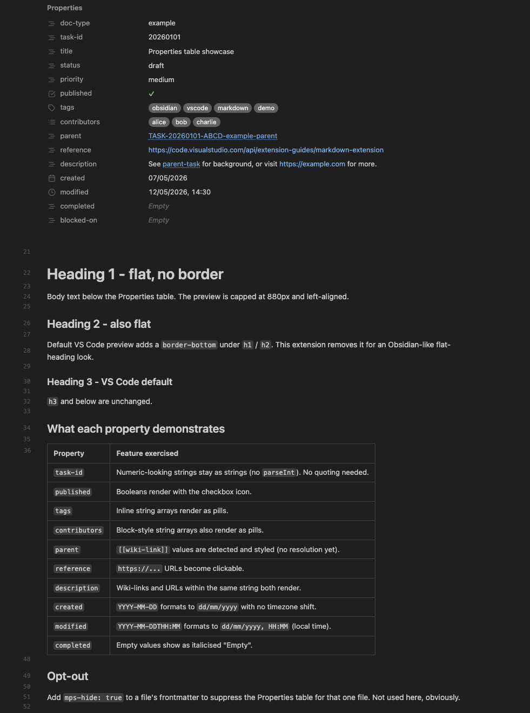

# markdown-preview-styles

[](https://github.com/samrobn/markdown-preview-styles/actions/workflows/ci.yml)

Local-only VS Code extension that customises the built-in markdown preview, globally across every workspace. Never published; sideloaded via symlink.

Two things it does:

1. Injects custom CSS into every preview (`markdown.previewStyles`).
2. Prepends an Obsidian-style **Properties** table above any markdown file with YAML frontmatter, plus a source-line gutter and other tweaks (`markdown.markdownItPlugins`).



## Install / re-install

The extension is symlinked into VS Code's extensions directory. The folder name must match `<publisher>.<name>-<version>` from `package.json`:

```
~/.vscode/extensions/local.markdown-preview-styles-0.2.0  →  ~/Dev/vscode-extensions/markdown-preview-styles
```

If the symlink is missing (new machine, accidental deletion, or after a version bump):

```bash
ln -s ~/Dev/vscode-extensions/markdown-preview-styles \
      ~/.vscode/extensions/local.markdown-preview-styles-0.2.0
```

Remove any older versioned symlinks (e.g. `local.markdown-preview-styles-0.0.1`) so VS Code doesn't load both. VS Code detects the changed extensions folder and prompts to reload - accepting that is enough; a full `Cmd+Q` is rarely needed.

## Related VS Code settings

The extension's defaults assume a few preview settings. Only `breaks` differs from VS Code's stock defaults; the others are noted for awareness:

- `"markdown.preview.breaks": true` - renders consecutive source lines as separate lines (Obsidian-style). Without this, a single newline collapses into a space within the same paragraph.
- `"markdown.preview.lineHeight": 1.6` *(default)* - `.mps-blank-line` is calibrated to `1.06lh` against this; changing it shifts the gutter rhythm.
- `"markdown.preview.fontSize": 15` - this repo is calibrated at 15 (VS Code's stock default is 14). The `em`-based spacing in `style.css` scales with whatever you set here.
- `"markdown.preview.linkify": true` *(default)* - auto-links bare URLs in body text; complements our Properties-value URL linking.
- `"markdown.preview.markEditorSelection": true` *(default)* - shows the editor-caret line in the preview. The hover-indicator variant is suppressed (line numbers occupy that pseudo-element); the active-line is instead highlighted by brightening its gutter line number, same convention as the editor.
- `"markdown.preview.doubleClickToSwitchToEditor": false` - VS Code defaults this to `true`; disable if you'd rather double-click select text in the preview than jump back to the editor. The visible line-number gutter still lets you eyeball the source row.
- `"markdown.preview.typographer": false` *(default)* - enable if you want smart quotes (`"x"` → `"x"`) and en/em dash auto-conversion.

## Example

`example.md` at the project root exercises every Properties-table feature in one file. Open the preview with `Cmd+K V` after install to verify everything renders.

## Current rules

- Caps preview width at 880px and left-aligns content (no centring).
- Lets wide **code blocks** and **tables** break out of that column into the free space to their right - sizing to their content, capped at the window edge - so long code lines and many-column tables aren't squashed to the prose measure. Content that already fits, and code/tables nested in callouts or lists, are untouched.
- Removes the default `border-bottom` under `h1` and `h2` (Obsidian-style flat headings).
- Headings render in **Martian Mono Light** (bundled, SIL OFL 1.1 - `fonts/OFL-martian-mono.txt`), a light monospace display treatment: weight 300, a full heading scale (`h1` 40px down to `h6` 12px at the default root), theme-default colour. Body prose renders in **iA Writer Quattro S** (bundled, SIL OFL 1.1 - `fonts/OFL-ia-writer-quattro.txt`, all four text faces) - note this deliberately overrides the `markdown.preview.fontFamily` setting. All the knobs (faces, weight, tracking, sizes) are CSS custom properties in the typography block at the top of `style.css`.
- Replaces VS Code's source-line hover indicator with permanent 1-indexed line numbers in a 4em left gutter; numbers also appear next to blank source lines.
- Default block margins on body content are zeroed so vertical spacing comes from blank-line placeholders - one source line ≈ one visual row, matching the editor's gutter rhythm.
- Inline code (backtick-quoted spans) shrunk to `0.9em`. Fenced code blocks inside `<pre>` are untouched.
- Renders YAML frontmatter as a Properties table with type-aware icons (text / list / tags / date / datetime / checkbox) and pill chips for `tags` and string arrays. Non-editable (v1).
- Resolves `[[wiki-links]]` against a **workspace-wide index** of every `.md` file under the open folders (plus any extra roots configured via `markdownPreviewStyles.wikilinks.extraIndexRoots`). Case-insensitive basename match; shortest-path tiebreak on collision. Supports the full Obsidian/Foam syntax matrix - see [Wikilink syntax](#wikilink-syntax) below.
- Renders Obsidian-style image embeds (`![[image.png]]`, with optional `![[image.png|N]]` for a px width). Bare filenames are retried under `attachments/` on first error. Failed loads show a dashed placeholder with the original path.
- Renders `![[note]]` (non-image) embeds **inline** as transclusions - the referenced note's body (frontmatter stripped) renders inside an `mps-embed-note` container. Optional `#heading` or `^block` fragment narrows the embed to that section. Recursive embeds are capped at depth 2 to prevent cycles.
- Add `mps-hide: true` to a file's frontmatter to suppress the Properties table for that file.
- Works around [an upstream VS Code bug](https://github.com/microsoft/vscode/issues/147718) where revisiting a preview tab shows stale content if the document changed while the tab was visible: the extension forces one preview refresh when a preview tab for a changed document becomes active.

## Wikilink syntax

| Form | Renders as |
|---|---|
| `[[name]]` | Link to `name.md` (resolved workspace-wide by basename). |
| `[[name\|alias]]` | Link to `name.md`, displaying `alias`. Pipe-after-name (Obsidian/Foam convention - not GitHub Wiki's pipe-before-name). |
| `[[name#heading]]` | Link to `name.md` and scroll to `#heading`. |
| `[[name^block]]` | Link to `name.md` and scroll to the paragraph or list-item carrying a trailing `^block` marker. |
| `[[name#heading\|alias]]` | Combined - canonical fragment-before-pipe order. |
| `![[image.png]]` | Inline image (with optional `\|N` for width). |
| `![[name]]` | Inline transclusion of the referenced note's body. |
| `![[name#heading]]` / `![[name^block]]` | Inline transclusion narrowed to that section/block. |

Reverse-order combined forms (`[[name|alias#heading]]`) are **not supported** - the trailing `#heading` becomes part of the alias display text and there is no anchor jump. The canonical fragment-before-pipe order matches Obsidian and the `markdown-it-wikilinks` parser.

Resolution is **case-insensitive on basename**. Multiple matches resolve by shortest path (fewest separators), then alphabetical within the same depth. When indexing multiple roots (workspace folders + `extraIndexRoots`), entries are ordered alphabetically by root path first - so shortest-path only carries meaning *within* a single root.

To pin a block as a scroll target, append `^my-id` at the end of a paragraph or list item. The extension strips the marker from the rendered text and adds `id="mps-block-my-id"` to the wrapping element so links can scroll to it.

## Settings

All settings live under `markdownPreviewStyles.wikilinks.*`:

| Key | Default | Purpose |
|---|---|---|
| `enabled` | `true` | Master switch. Off = document-relative resolution (no workspace index). |
| `extraIndexRoots` | `[]` | Extra folders to index alongside the open workspace. Useful when you keep notes outside the workspace (e.g. `~/Documents/notes`). Tilde-prefixed paths are expanded. Missing paths are skipped with a warning. |
| `embedNotes` | `true` | Whether `![[name]]` for non-image targets renders inline (`true`) or as a link with the `mps-embed-fallback` style (`false`). |
| `embedMaxBytes` | `262144` (256KB) | Size cap for inline transclusion. Targets at or above the cap degrade to a link; `0` disables transclusion entirely. |

The four keys appear in VS Code's Settings UI under "Markdown Preview Styles → Wikilinks".

## Supported frontmatter

Top-level scalars (string, boolean, null, ISO date `YYYY-MM-DD`, ISO datetime `YYYY-MM-DDTHH:MM[...]`), block-style arrays (`tags:` followed by `  - foo`), and inline arrays (`tags: [foo, bar]`). Numeric values stay as strings to preserve IDs like `task-id: 20260101`. Nested objects, multiline strings, anchors, and flow maps are not supported.

Date-only values are formatted without timezone shift so the day always matches what's in the YAML.

## Known limitations

- **Workspace index is built asynchronously on activation.** Open previews are refreshed automatically once the index finishes building, but there's a brief window where wikilinks render with document-relative hrefs before the refresh fires.
- **Watcher behaviour on iCloud-synced roots is noisy.** If you point `extraIndexRoots` at an iCloud folder, the file watcher fires on sync events as well as edits. Index correctness is unaffected; CPU may briefly spike on heavy sync activity.
- **Wiki-link `<a>` clicks go through VS Code's webview link handler.** Non-existent targets (no index match and no document-relative file) surface a "file not found" toast rather than navigating anywhere - no in-preview broken-link styling.
- **Cross-root collision ordering.** When two indexed roots both contain a file with the same basename, the resolver orders entries alphabetically by root path then by relative path. "Shortest path" only applies within a single root.

## Development

See [CLAUDE.md](CLAUDE.md) for the reload-by-change-type matrix, architecture gotchas, tests, and project conventions.
